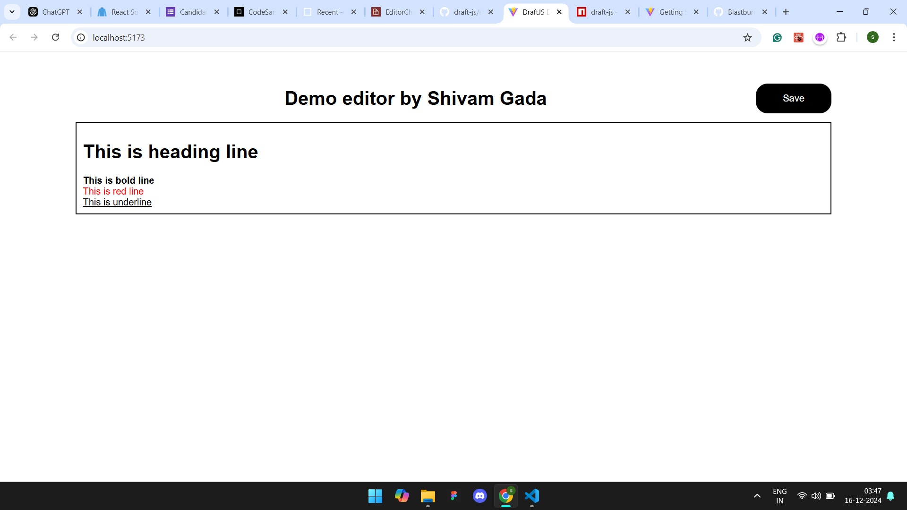

# Rich Editor using DraftJS

I have made this editor using React + Vite.

Type #, *, **, and *** with a space to enable the features.

1. < * > - Makes text bold
2. < ** > - Makes text red
3. < *** > - Makes text italic
4. < # > - Makes text Heading

---

# Run website locally

```bash
cd <RichEditor>
npm install
npm run dev
```
---
# Screenshot of Application

